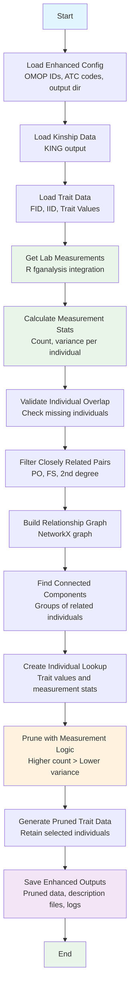

# Post-hoc Relatedness Pruning Workflow for GWAS Analysis

A robust, modular Python workflow for removing closely related individuals from large cohorts after phenotype calculation. The pruning is based on pre-calculated kinship coefficients and lab measurement-based prioritization criteria to mitigate inflation of test statistics, particularly across rare variants, due to cryptic relatedness.

## Overview

This enhanced workflow removes closely related individuals (up to 2nd degree relatives) from large cohorts using a **measurement-based prioritization system**. For each pair of related individuals, one is retained based on lab measurement quality:

1. **Higher number of measurements** are preferred over lower numbers
2. **Lower variance among measurements** (tie-breaker for equal counts)
3. **Random selection** (final tie-breaker for exact duplicates)

The system integrates with the R `fganalysis` package to access lab measurement data from parquet files and automatically generates description files matching the existing format.

## Enhanced Workflow Diagram



## Installation

### Prerequisites

- Python 3.7 or higher
- R 4.0 or higher with the `fganalysis` package installed
- Required Python packages (see `requirements.txt`)
- Access to FinnGen parquet data files

### Setup

1. Clone or download the script files to your desired directory
2. Install required dependencies:

```bash
pip install -r requirements.txt
```

## Usage

### Enhanced Configuration Processing

Create an enhanced JSON configuration file:

```json
{
  "kinship_file": "/path/to/kinship.kin0",
  "db_config_path": "/path/to/db_config.json",
  "output_dir": "/path/to/output",
  "trait_files": [
    {
      "trait_file_path": "/path/to/trait1.tsv",
      "omop_concept_id": "3013603",
      "atc_codes": ["A12A", "G04CB", "G04C"],
      "months_before": 1,
      "output_file_prefix": "Prostate_Specific_Antigen_PSA_males_only_3013603_pre_medication"
    },
    {
      "trait_file_path": "/path/to/trait2.tsv",
      "omop_concept_id": "3026910",
      "atc_codes": ["N03A", "C03", "C10AA"],
      "months_before": 1,
      "output_file_prefix": "Gamma_Glutamyl_Transferase_GGT_3026910_pre_medication"
    }
  ]
}
```

Then run:

```bash
python enhanced_relatedness_pruning.py \
    --config enhanced_config.json \
    --output-dir /path/to/output
```

### Legacy Single Trait File Processing

```bash
python relatedness_pruning.py \
    --kinship-file /path/to/kinship.kin0 \
    --trait-file /path/to/trait.tsv \
    --output-dir /path/to/output
```

### Command Line Options

- `--kinship-file`: Path to kinship file (KING output)
- `--trait-file`: Path to trait file (required with --kinship-file)
- `--config`: Path to JSON configuration file for batch processing
- `--output-dir`: Output directory for results (required)
- `--log-level`: Logging level (DEBUG, INFO, WARNING, ERROR, default: INFO)
- `--log-file`: Optional log file path

## Input Data Formats

### Kinship Data (KING Output)

The kinship file should be tab-separated with the following columns:

| Column | Description | Example |
|--------|-------------|---------|
| FID1 | Family ID for first individual | F001 |
| ID1 | Individual ID for first individual | I001 |
| FID2 | Family ID for second individual | F002 |
| ID2 | Individual ID for second individual | I002 |
| InfType | Inferred relationship type | PO, FS, 2nd, 3rd, UN |
| Kinship | Kinship coefficient (optional) | 0.25 |

**Closely Related Types**: Dup/MZ, PO, FS, 2nd

### Trait Data

The trait file should be tab-separated with the following columns:

| Column | Description | Example |
|--------|-------------|---------|
| FID | Family ID | F001 |
| IID | Individual ID | I001 |
| [Trait Column] | Quantitative trait value | 1.23 |

- The third column (or first non-FID/IID column) is used as the trait value
- Missing values should be represented as NA, NaN, or empty strings

## Output Files

For each processed trait file, the following outputs are generated:

### 1. Pruned Trait Data
- **Filename**: `{original_name}_related_pruned.tsv`
- **Content**: Original trait data with only unrelated individuals retained
- **Format**: Same as input trait file with the following enhancements:
  - **No empty rows**: All empty rows are removed
  - **Proper NA coding**: Missing values are coded as 'NA'
  - **Renamed third column**: The trait column is renamed to match the output filename (without .tsv suffix)
    - Example: For `Gamma_Glutamyl_Transferase_GGT_3026910_pre_medication_3026910_DF13_blup_related_pruned.tsv`, the third column becomes `Gamma_Glutamyl_Transferase_GGT_3026910_pre_medication_3026910_DF13_blup_related_pruned`

### 2. Removed Individuals List
- **Filename**: `{original_name}_removed_individuals.txt`
- **Content**: List of individuals removed during pruning
- **Format**: Tab-separated with FID and IID columns

### 3. Pruning Log
- **Filename**: `{original_name}_pruning_log.txt`
- **Content**: Detailed summary of the pruning process including:
  - Summary statistics (original, pruned, removed counts)
  - Relationship analysis (pair counts, component sizes)
  - Trait value statistics
  - Validation results
  - Missing individuals information

### 4. Description File (Enhanced)
- **Filename**: `{original_name}_related_pruned_descriptionfile.tsv`
- **Content**: Auto-generated description matching existing format
- **Example**: "3013603 pre-medication (BLUPs, calculated from 1% Winsorised measurements and rank-normalised), OMOP_concept_id:3013603- Longitudinal measurements across 8,511 unrelated individuals with >=3 measurements up to 1 days before A12A, G04CB, G04C intake or no drug purchase history."

### 5. Enhanced Pruning Log
- **Filename**: `{original_name}_enhanced_pruning_log.txt`
- **Content**: Detailed summary including measurement statistics

### 6. Enhanced Summary JSON
- **Filename**: `{original_name}_enhanced_pruning_summary.json`
- **Content**: Machine-readable summary with measurement data

### 7. Batch Summary (for multiple files)
- **Filename**: `enhanced_batch_pruning_summary.txt`
- **Content**: Overall summary when processing multiple files

## Pruning Algorithm

### Relationship Filtering

The workflow identifies closely related individuals based on KING relationship types:

- **Dup/MZ**: Duplicate samples or monozygotic twins (φ ≈ 0.5)
- **PO**: Parent-offspring relationships (φ ≈ 0.25)
- **FS**: Full siblings (φ ≈ 0.25)
- **2nd**: Second-degree relatives (φ ≈ 0.125)

### Enhanced Prioritization Rules

For each connected component of related individuals, one individual is retained based on **lab measurement quality**:

1. **Measurement Count**: Individuals with higher number of measurements are preferred
2. **Measurement Variance**: Among individuals with equal measurement counts, those with lower variance are preferred
3. **Random Selection**: For exact ties (very unlikely), random selection is used

### Example Decision Process

Consider a family with three siblings (A, B, C) with measurement statistics:
- Individual A: 8 measurements, variance = 0.15
- Individual B: 12 measurements, variance = 0.22 (higher count)
- Individual C: 8 measurements, variance = 0.08 (lower variance than A)

**Decision**: Retain Individual B (highest measurement count: 12)

If counts were equal (e.g., both A and C had 8 measurements), then Individual C would be retained (lower variance: 0.08 vs 0.15).

### Rank Normalization (Optional)

The workflow includes an optional rank normalization feature that can be applied to trait values after pruning. When enabled with the `--rank-normalize` flag:

1. **Non-missing values** are converted to ranks using the average method
2. **Missing values** remain as missing (NA)
3. **Rank transformation** helps reduce the impact of extreme values and outliers

This is particularly useful for:
- **Non-normal trait distributions** (skewed, heavy-tailed)
- **Outlier sensitivity** reduction
- **Robust statistical analysis** preparation

**Example**: If trait values are [1.2, 3.4, 2.1, 5.8, NA], the rank-normalized values become [1.5, 3.0, 2.0, 4.0, NA].

## Module Structure

The workflow is organized into modular components:

### `data_loader.py`
- Loads and validates kinship and trait data
- Handles configuration file parsing
- Validates individual overlap between datasets

### `relationship_filter.py`
- Filters closely related pairs from kinship data
- Builds relationship networks using NetworkX
- Identifies connected components of related individuals

### `lab_measurement_analyzer.py` (Enhanced)
- Integrates with R `fganalysis` package
- Accesses lab measurement data from parquet files
- Calculates measurement statistics (count, variance)
- Implements measurement-based prioritization logic

### `pruning_engine.py`
- Implements the core pruning algorithm
- Applies enhanced prioritization rules based on measurement quality
- Generates pruning summaries and statistics
- Supports both measurement-based and trait-based fallback

### `output_generator.py`
- Creates enhanced output files (pruned data, description files, logs)
- Generates comprehensive reports with measurement statistics
- Handles batch processing summaries
- Auto-generates description files matching existing format

### `enhanced_relatedness_pruning.py` (Enhanced)
- Main enhanced script with command-line interface
- Orchestrates the entire enhanced workflow
- Handles R integration and measurement analysis
- Supports enhanced configuration format

### `relatedness_pruning.py` (Legacy)
- Original script with trait-based prioritization
- Maintains backward compatibility
- Supports single file and batch processing

## Error Handling

The workflow includes comprehensive error handling for:

- **File Not Found**: Missing input files
- **Invalid Format**: Malformed data files
- **Missing Columns**: Required columns not present
- **Data Validation**: Inconsistent individual IDs
- **Processing Errors**: Issues during pruning

## Logging

The workflow provides detailed logging at multiple levels:

- **INFO**: General progress and summary statistics
- **WARNING**: Non-critical issues (e.g., missing individuals)
- **ERROR**: Critical failures that stop processing
- **DEBUG**: Detailed debugging information

## Performance Considerations

- **Memory Usage**: Large kinship files are loaded entirely into memory
- **Processing Time**: Scales with the number of related pairs and components
- **NetworkX**: Used for efficient graph operations on relationship networks

## Example Workflow

### Enhanced Measurement-Based Processing

```bash
# Process with enhanced configuration (recommended)
python enhanced_relatedness_pruning.py \
    --config /config/enhanced_config.json \
    --output-dir /results/enhanced_pruning \
    --log-level INFO

# With custom log file
python enhanced_relatedness_pruning.py \
    --config /config/enhanced_config.json \
    --output-dir /results/enhanced_pruning \
    --log-file /results/enhanced_pruning.log
```

### Legacy Trait-Based Processing

```bash
# Process a single trait file (legacy)
python relatedness_pruning.py \
    --kinship-file /data/kinship.kin0 \
    --trait-file /data/psa_trait.tsv \
    --output-dir /results/psa_pruning \
    --log-level INFO

# With rank normalization (legacy)
python relatedness_pruning.py \
    --kinship-file /data/kinship.kin0 \
    --trait-file /data/psa_trait.tsv \
    --output-dir /results/psa_pruning \
    --rank-normalize
```

## Troubleshooting

### Common Issues

1. **Missing Individuals**: Some individuals in trait data may not be found in kinship data
   - **Solution**: Check that both files use the same individual ID format
   - **Impact**: Missing individuals are reported but don't affect processing

2. **No Related Pairs Found**: All individuals appear unrelated
   - **Solution**: Verify kinship file contains relationship data
   - **Impact**: No pruning occurs, all individuals are retained

3. **Memory Issues**: Large datasets cause memory problems
   - **Solution**: Process files individually or increase system memory
   - **Impact**: Processing may fail or be very slow

### Validation Checks

The workflow performs several validation checks:

- Individual ID format consistency
- Required column presence
- Data type validation
- Relationship type validation

## Handling of Missing Individuals

### FINNGENIDs Not Found in Kinship File

When processing trait files, some FINNGENIDs may not be present in the kinship file. The workflow handles these cases as follows:

1. **Detection**: During the validation phase, the system identifies all individuals present in the trait file but missing from the kinship file.

2. **Automatic Retention**: Individuals not found in the kinship file are **automatically retained** in the pruned output because:
   - They have no known relatives in the dataset (no kinship coefficients)
   - They cannot form related pairs requiring pruning
   - They are effectively "unrelated" by definition

3. **Logging**: Missing individuals are:
   - Counted and reported in the log files
   - Listed individually if the count is small (< 100)
   - Summarized with total count if numerous

4. **No Impact on Pruning**: These individuals:
   - Do not participate in the relationship graph
   - Are not considered for removal
   - Appear in the final pruned output with their original trait values (inverse rank normalized if enabled)

This behavior ensures that individuals without kinship information (e.g., new samples, technical replicates, or samples excluded from kinship calculation) are preserved in the analysis while still removing known related individuals.

## Version History

- **v2.1.0**: Enhanced release with inverse rank normalization and R integration
  - **Full R fganalysis integration** for accessing lab measurement data
  - **Inverse rank normalization** as default behavior after pruning
  - **Measurement-based prioritization** exclusively (removed trait-based fallback)
  - **Enhanced configuration** with database paths and output directory specification
  - **Improved error handling** and debugging capabilities

- **v2.0.0**: Enhanced release with measurement-based prioritization
  - Lab measurement integration with R `fganalysis` package
  - Measurement-based prioritization (count > variance)
  - Auto-generated description files
  - Enhanced configuration format
  - Backward compatibility with trait-based approach

- **v1.0.0**: Initial release with core pruning functionality
  - Single and batch file processing
  - Comprehensive logging and reporting
  - Modular architecture
  - Command-line interface
